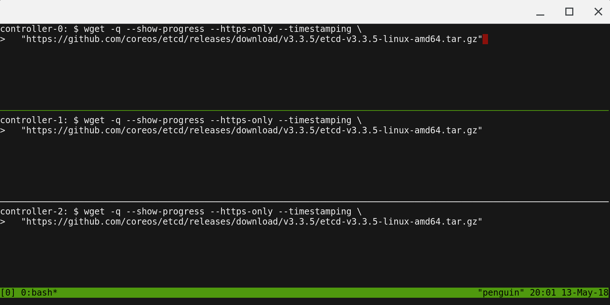

# Prerequisites

## Scaleway

This tutorial leverages [Scaleway](https://console.scaleway.com/) to streamline provisioning of the compute infrastructure required to bootstrap a Kubernetes cluster from the ground up. It would cost less then $2 for a 24 hour period that would take to complete this exercise.

> There is a free tier for Scaleway, but it doesn't let you create any resources. At time of writing, they have both a Test and Build tier, both of which require billing information. Make sure that you clean up the resource at the end of the activity to avoid incurring unwanted costs.

## Scaleway CLI

### Install the Scaleway CLI

Follow the Scaleway CLI [documentation](https://github.com/scaleway/scaleway-cli) to install and configure the `scw` command line utility.

The current walkthrough was done with version 2.26.0

Verify the CLI version using:

```sh
scw version
```

and then you can be guided through setting up the CLI to access your account:

```sh
scw init
```

it's recommended to set your default zone to `fr-par-2`, since the power sources used there are a bit more eco-friendly than `fr-par-1`.

```sh
scw config set default-zone=fr-par-2
```


## Running Commands in Parallel with tmux

[tmux](https://github.com/tmux/tmux/wiki) can be used to run commands on multiple compute instances at the same time. Labs in this tutorial may require running the same commands across multiple compute instances, in those cases consider using tmux and splitting a window into multiple panes with `synchronize-panes` enabled to speed up the provisioning process.

> The use of tmux is optional and not required to complete this tutorial.



> Enable `synchronize-panes`: `ctrl+b` then `shift :`. Then type `set synchronize-panes on` at the prompt. To disable synchronization: `set synchronize-panes off`.

Next: [Installing the Client Tools](02-client-tools.md)
